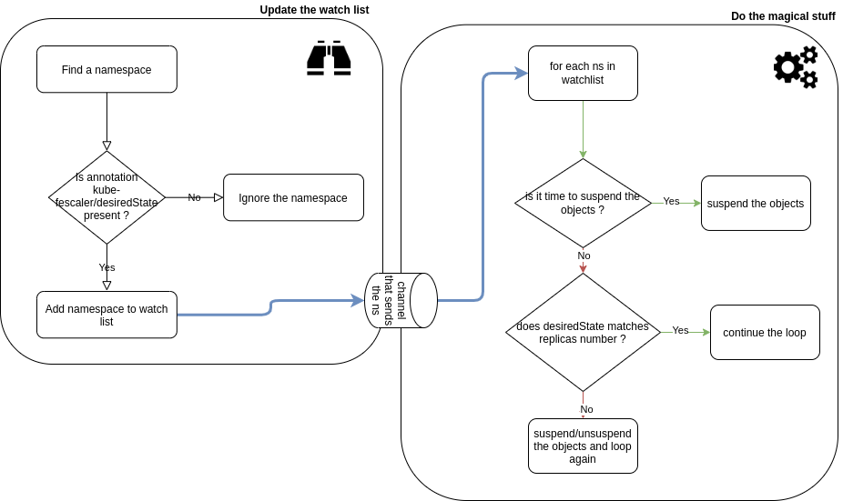

# kube-ns-suspender

Inspired by [kube-downscaler](https://codeberg.org/hjacobs/kube-downscaler/)

<!-- START doctoc generated TOC please keep comment here to allow auto update -->
<!-- DON'T EDIT THIS SECTION, INSTEAD RE-RUN doctoc TO UPDATE -->
**Table of Contents**  *generated with [DocToc](https://github.com/thlorenz/doctoc)*

- [Goals](#goals)
- [Use-cases](#use-cases)
  - [Pausing (Auto)](#pausing-auto)
  - [Pausing (ByUser)](#pausing-byuser)
  - [UnPausing (ByUser)](#unpausing-byuser)
- [Specs](#specs)
  - [Annotations](#annotations)
  - [Behavior](#behavior)
  - [Diagram](#diagram)
- [Questions](#questions)

<!-- END doctoc generated TOC please keep comment here to allow auto update -->

## Goals

* @govirtuo, an FeatureEnvironment === a whole `namespace` with many `Deployments` and `StatefulSets`, `CronJobs` in there.
* We want to "pause" an FE by downscaling every "deployments" (:point_up:) to 0 for resources and costs motivations.

## Use-cases

### Pausing (Auto)

A user creates an FE one day at a certain time.

* "deployments" are "up" and isolated at the Namespace level
* Everyday, at a specific time (configurable), the controller checks:
    - Is the FEs "paused"
    - if NOT, "pause" it
        + Iterate through all "deployments" in the Namespace
        + Set the `replicas` field to 0

### Pausing (ByUser)

A user watns to "pauses" an FE.

* Using the tool at his disposal, he "pauses" the FE
    - Under the hood, an `annotation` is set on the Namespace
* The controller
    - Watches all Namespaces
    - Looks up for a specific `annotation` (ToBeDefined)
    - Detects the need to "pause" the FE
        + Iterates around all "deployments" in the Namespace
        + Sets the `replicas` field to 0

### UnPausing (ByUser)

A user needs to work on a FE that is "paused""

* Using the tool at his disposal, "unpause" the FE
    - An `annotation` is put / removed on the namespace representing the FE
* The controller
    - Watches all Namespaces
    - Looks-up for a specific `annotation` (ToBeDefined)
    - Detects the need to "un-pause" the FE
        + Iterates around all "deployments" in the Namespace
        + Restores the `replicas` value

## Specs

### Annotations

2 annotations on each `Namespace`:
* `kube-fesuspender/desiredState`: {Running, Suspended}
* `kube-fesuspender/suspendAt`  (Optional)

On downstream Objects (technical annotation)
* `kube-fesuspender/originalReplicas`

### Behavior

`kube-fescaler/desiredState`:
  * Suspended => check if replica set is 0, and act accordingly (ignore or scale down)
  * Running => check if replica set is > 0

Check if state matches the number of replicas (i.e if state == Nominal && replicas == 0, there is an issue). State should be the reference:
* if state == Nominal && replicas == 0, increase the number of replicas if every deployment
* if state == DownScaled && replicas == n + 1, downscale the deployments
This allows us to edit only the state annotation when we need to scale up the deployments.

`kube-fescaler/suspendAt (Optional)`:
time to downscale the number of replicas in the namespace
  -> define a time format (iso8601 ?)

### Diagram

<a href="https://app.diagrams.net/#Uhttps%3A%2F%2Fraw.githubusercontent.com%2Fgovirtuo%2Fkube-ns-suspender%2Fmain%2Fdocs%2Farchitectures%2Fassets%2F0-designProposal.png" target="_blank">Edit As New</a> | <a href="https://app.diagrams.net/#Hgovirtuo%2Fkube-ns-suspender%2Fmain%2Fdocs%2Farchitectures%2Fassets%2F0-designProposal.png" target="_blank">Edit in diagrams.net</a>

## Questions

- [x] How to keep the initial number of replicas in memory ? Persistent/volatile ? Redis ?
    + When a namespace is added to watch list, add `kube-fescaler/originalReplicas` annotation on each downstream object (deployments...).

- [x] How to manually scale up the deployment 
    + Edit the live manifest of the Namespace by updating the `kube-fesuspender/desiredState` annotation to "Running"

- [x] What about crons ? how to stop them ?
    + `CronJobs` have a `suspended` field. We need to handle these downstream Objects and update this field.

